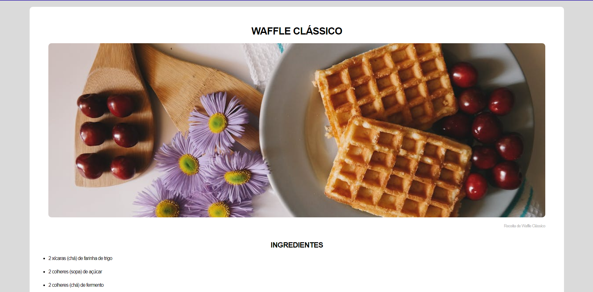
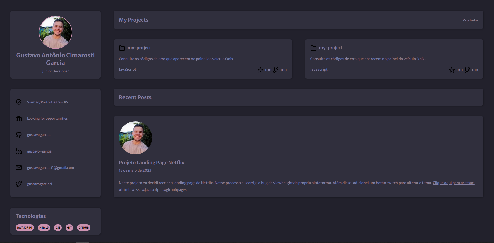
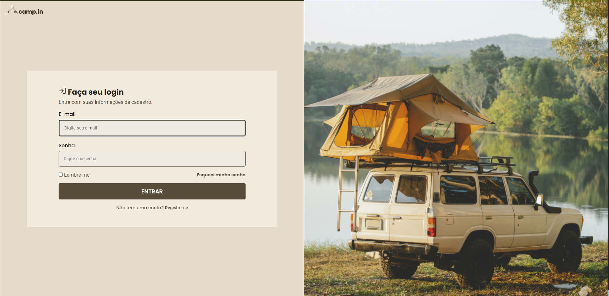
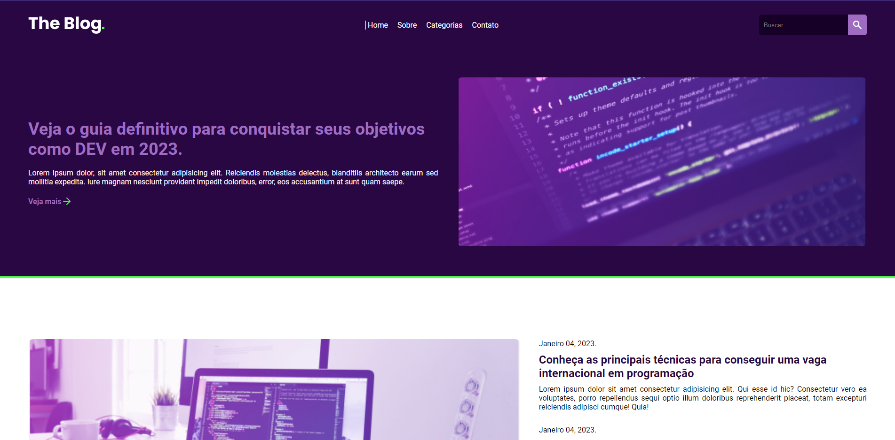
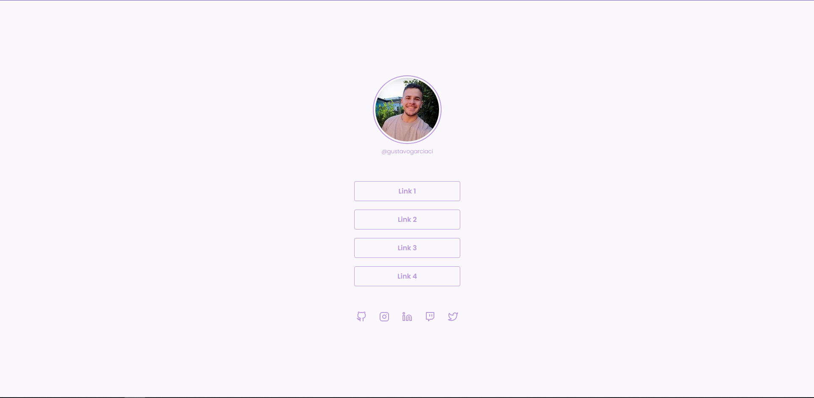
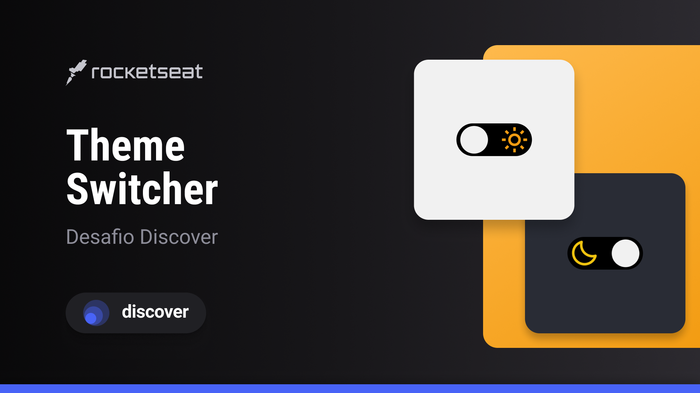

# 👩‍💻 Curso Discover Rocketseat
 Iniciando o curso Discover da Rocketseat.

## 💾 Projetos:
Segue abaixo a lista de projetos e desafios criados durante o curso Discover:

### 001 Receita:

### 002 Portfólio:
 

### 003 Login Form:

### 004 RocketBlog:

### 005 RocketNews:

### 006 Social Tree:

### 007 Theme Switcher:

